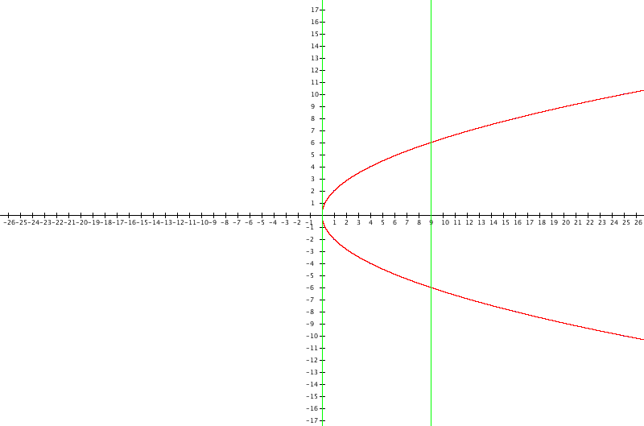
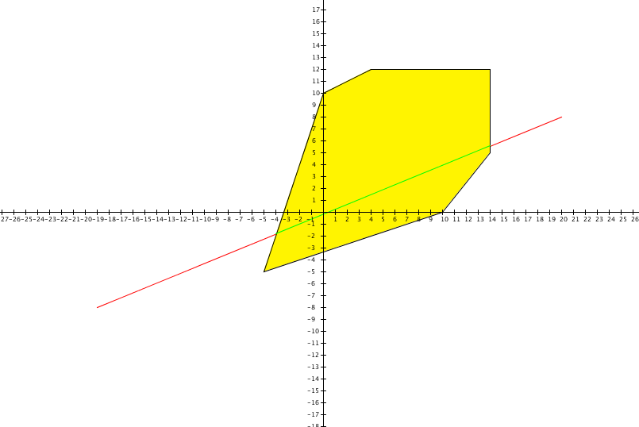

# ComputerGraphic-Tasks
Implementation of Computer Graphic Tasks
<b>1) FullFill the plane with hexagones,dodecagones and squares using processing</b>

<b>2) Draw parametric and none parametric parabola using processing</b>

<b>3) Cyrus-Beck line clipping algorithm using processing</b>

